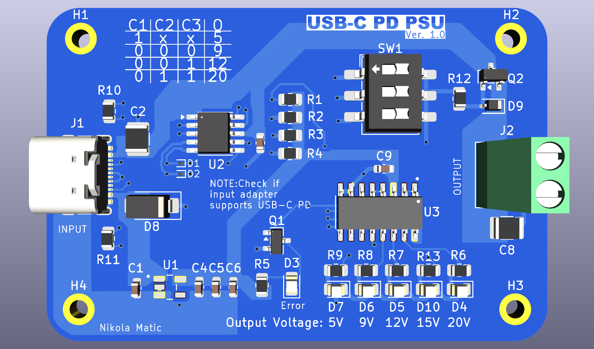

# USB-C PD Adjustable Power Supply

Based on [FEDEVEL](https://github.com/FEDEVEL/usbc-advanced-power-supply) design.
A compact USB-C Power Delivery (PD) power supply that accepts power from a USB-C PD adapter and provides a manually selectable output voltage through a DIP switch.

## Features

- USB-C PD input
- Up to **100 W** PD capability
- **5 V, 9 V, 12 V, 15 V, and 20 V** selectable outputs
- Manual voltage selection using a DIP switch
- **CH224K** USB-C PD sink controller
- LED indication of the selected output voltage
- Error indication for unsuccessful PD negotiation
- 3.3 V auxiliary supply using a **TPS70933DBVR** LDO
- 4-layer PCB with dedicated ground and power planes
- 90 Ω controlled-impedance USB 2.0 differential pair

## License
[CreativeCommons-Attribution-NonCommercial-ShareAlike 4.0 International](https://creativecommons.org/licenses/by-nc-sa/4.0/?ref=chooser-v1)

